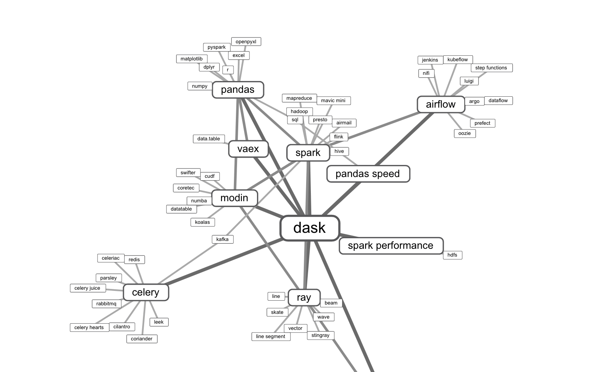
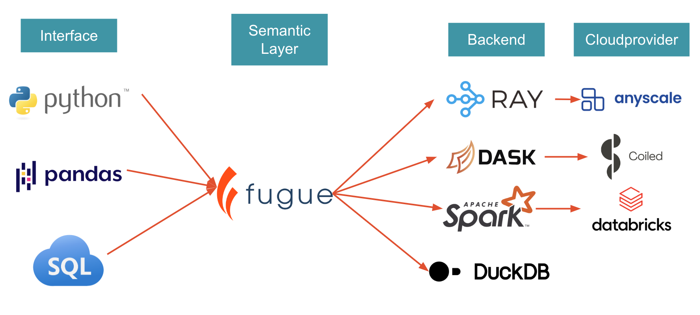

# Advanced Python Data Patterns

*When and **how** to move beyond `pandas`*

## Introduction

... out of memory ... remote data ... 

## Contents

### DataFrames, single-machine

Let's look at this data: https://www.kaggle.com/datasets/peopledatalabssf/free-7-million-company-dataset/

* `pandas`
* `duckdb`
* `polars`
* `vaex` (this is old now?)
* `DataFusion` https://arrow.apache.org/datafusion/user-guide/faq.html#how-does-datafusion-compare-with-xyz (more for devs, not data people)

#### The Winner

https://motherduck.com/blog/duckdb-versus-pandas-versus-polars/

https://github.com/prrao87/duckdb-study/blob/main/perf_study/polars_generate.py

* DataFusion is great if you're using Rust ...
* Polars is much faster than Pandas, but much less stable now
* DuckDB is also great, but it's SQL ... we probably want some way to use it like a Python object
* Pandas is still the standard for small data analytics. The interface is well understood, all other libraries will output to Pandas for the small stuff once you get the benefit of the more powerful processing

### Multi-core, embarrassingly parallel
* `pyspark`
* `dask`
* `modin` (on ray)

#### The Winner

https://censius.ai/blogs/apache-spark-vs-dask-vs-pandas#blogpost-toc-5

https://www.datarevenue.com/en-blog/pandas-vs-dask-vs-vaex-vs-modin-vs-rapids-vs-ray

* Modin + Dask both take the *Pandas at scale* approach
* Modin is neat mostly because it runs on Ray, which is it's own optimization layer for distributed compute that's become somewhat popular
* Really though, Dask and Modin and Spark can all run on Ray, even in traditional Spark clusters (like Databricks) ...
* This is mostly a sign of changing times where we don't need to pick just one thing .... hence the next section

### New (and old) abstraction layers
* `sqlalchemy` (not for analytics really)
    * https://github.com/Mause/duckdb_engine
* `ibis`: for data in *SQL* dbs
* `fugue`: back to basics

#### The Winner 

SqlAlchemy vs. Ibis vs. Fugue

* SqlAlchemy is not for analytics, great for a webpage backend
* https://fugue-tutorials.readthedocs.io/tutorials/integrations/backends/ibis.html

### Conclusion

**Premature optimization is the root of all evil**

## Notes

* Interesting blog post on *DataFrames and SQL* https://kestra.io/blogs/2023-08-11-dataframes
